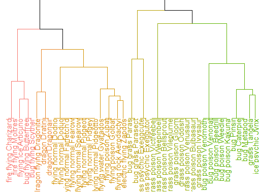
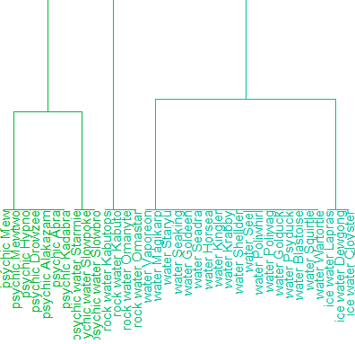
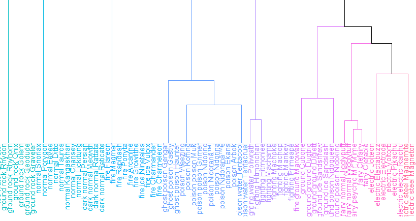

# Anime Recommender System
## IMPORTS
```{r anime, include=FALSE}
library(recommenderlab)
library(proxy)
library(class)
library(data.table)
```
## DATA
```{r anime.data}
#Load data (Change filepath to Anime.RData location)
load('Anime.RData')
```

#Loads in TV Ratings data
```{r anime.data.cleaning, include=FALSE}
tv.full = read.csv(file.choose())

#tv without user_id
tv = tv.full[,-c(1,2)]

#Creating Real Ratings Matrix
tv.mat <- as(tv, 'matrix')
tv.mat <- as(tv.mat, 'realRatingMatrix')
dim(tv.mat)
```

## MODEL SELECTION EVALUATION
```{r anime.selection.eval, eval=FALSE}
#Testing all recommenders
explore.scheme = evaluationScheme(tv.mat, method= 'split', train = 0.85, k = 1, given = 1, goodRating = 7)

#Setting algorithms to test
explore.algorithms <- list(
  'random items' = list(name = 'RANDOM', param = list(normalize = 'Z-score')),
  'popular items' = list(name = 'POPULAR', param = list(normalize = 'Z-score')),
  'user-based CF' = list(name = 'UBCF', param = list(normalize = 'Z-score', method = 'Cosine', nn=50)),
  'item-based CF' = list(name = 'IBCF', param = list(normalize = 'Z-score'))
  )

#Evaluating all algorithms
explore.results = evaluate(explore.scheme, explore.algorithms, n=c(1, 3, 5, 10, 15, 20))
```

#Plotting model results for comparison (TPR and FPR)
```{r anime.plotting.TPR.and.FPR.model}
plot(explore.results, annotate = 1:4, legend = 'topleft')
```
#Plotting model results for comparison (precision and recall)
```{r anime.plotting.precision.and.recall.model}
plot(explore.results, 'prec/rec', annotate = 2:3)
```

## FINAL RECOMMENDER MODEL
```{r anime.recommender.model.creation, eval=FALSE}
#Creating test and training data for final model
tv.scheme = evaluationScheme(tv.mat, method= 'split', train = 0.666666, given = 1, goodRating = 7)

#Fitting the popular items recommender on the training data
tv.pop.rec = Recommender(getData(tv.scheme, 'train'), method = 'POPULAR')
```

#Creating top 10 list for all users
```{r anime.creating.top10, eval=FALSE}
new.users.top10 = predict(tv.pop.rec, getData(tv.scheme, 'known'), n=10)
as(new.users.top10, 'list')
```

#Creating top 10 list for sample of 10
```{r anime.creating.top10.sample, eval=FALSE}
sample.new.users.top10 = predict(tv.pop.rec, getData(tv.scheme, 'known')[1:10,], n=10)
sample.new.users.top10.list <- as(sample.new.users.top10, 'list')
```

#Printing top 10 list for sample of 10
```{r anime.printing.top10.sample.list}
sample.new.users.top10.list
```

#Creating and cleaning a string version of the list for the sample of 10
```{r anime.cleaning.top10.sample.list, eval=FALSE}
sample.new.users.top10.string <- as.character(sample.new.users.top10.list)
sample.new.users.top10.string <- gsub('c\\(', '', sample.new.users.top10.string)
sample.new.users.top10.string <- gsub('\\)', '', sample.new.users.top10.string)
```

#Preparing the counts of anime TV series that appear in the top 10 list for 10 users
```{r anime.preparing.top10.anime.counts, eval=FALSE}
sample.new.users.top10.list.split <- unlist(strsplit(sample.new.users.top10.string, split = ','))
sample.new.users.top10.list.split.dt <- data.table(sample.new.users.top10.list.split)
colnames(sample.new.users.top10.list.split.dt)[colnames(sample.new.users.top10.list.split.dt)=="sample.new.users.top10.list.split"] <- "anime_title"
sample.new.users.top10.anime.counts <- sample.new.users.top10.list.split.dt[, .(count = .N), by = sample.new.users.top10.list.split.dt[,1]]
```

#Printing top anime counts for sample of 10 users
```{r anime.print.top10.anime.counts}
print(sample.new.users.top10.anime.counts)
```


# Pokemon Cluster Analysis
```{r pokemon, include=FALSE}
library(cluster)
library(dplyr)
library(factoextra)
library(stringr)
pokemon = read.csv(file="C:/Users/ic2009ml/Documents/GitHub/DSCI415-Final-Project/data/pokemon.csv", header=TRUE, sep=",", stringsAsFactors = FALSE)
pokemon <- pokemon %>% mutate(type = paste(type1, type2) %>% str_split(., ' ') %>% lapply(., 'sort') %>%  lapply(., 'paste', collapse=' ') %>% unlist(.))
pokemon <- pokemon %>% mutate(name.type = paste(type, name))
pokemon <- pokemon[1:151,]
rownames(pokemon) <- pokemon$name.type
pokemon.mat <- pokemon[2:19]
```

## Overall data
```{r pokemon.overall.data}
colnames(pokemon)
```

## Data for clustering
```{r pokemon.clustering.data}
colnames(pokemon[2:19])
pokemon.mat[1,]
```

## Finding k: wss
```{r pokemon.finding.k.wss}
fviz_nbclust(pokemon.mat,kmeans,k.max=25,method="wss")
```

## Finding k: silhouette
```{r pokemon.finding.k.silhouette}
fviz_nbclust(pokemon.mat,kmeans,k.max=25,method="silhouette")
```

## Finding k: gap_stat
```{r pokemon.finding.k.gap_stat}
fviz_nbclust(pokemon.mat,kmeans,k.max=25,method="gap_stat")
```

## Hierarchical clustering
We choose k = 18 which is the total number of types
```{r pokemon.hclust, echo=F}
k = 18
pokemon.dist <- dist(pokemon.mat)
pokemon.hclust <- hclust(pokemon.dist, method="ward.D")
fviz_dend(pokemon.hclust, k=k)
```

## Zoomed on clusters 1


## Zoomed on clusters 2


## Zoomed on clusters 3


# Seinfeld Text Mining
```{r seinfeld, include=FALSE}
library(syuzhet)
library(dplyr)
library(wordcloud)
library(tm)
cbind.all <- function (...) {
  nm <- list(...)
  nm <- lapply(nm, as.matrix)
  n <- max(sapply(nm, nrow))
  do.call(cbind, lapply(nm, function(x) rbind(x, matrix(, n - nrow(x), ncol(x)))))
}

clean.text <- function(some_txt){
  some_txt = gsub("(RT|via)((?:\\b\\W*@\\w+)+)", "", some_txt)
  some_txt = gsub("@\\w+", "", some_txt)
  some_txt = gsub("[[:punct:]]", "", some_txt)
  some_txt = gsub("[[:digit:]]", "", some_txt)
  some_txt = gsub("http\\w+", "", some_txt)
  some_txt = gsub("[ \t]{2,}", "", some_txt)
  some_txt = gsub("^\\s+|\\s+$", "", some_txt)
  # define "tolower error handling" function
  try.tolower = function(x)
  {
    y = NA
    try_error = tryCatch(tolower(x), error=function(e) e)
    if (!inherits(try_error, "error"))
      y = tolower(x)
    return(y)
  }
  some_txt = sapply(some_txt, try.tolower)
  some_txt = some_txt[some_txt != ""]
  names(some_txt) = NULL
  return(some_txt)
}
show = read.csv(file="C:/Users/ic2009ml/Documents/GitHub/DSCI415-Final-Project/data/scripts.csv", header=TRUE, sep=",", stringsAsFactors = FALSE)
show.title <- "Seinfeld"
seasons <- unique(show$Season)
```

## Data
```{r seinfeld.overall.data}
colnames(show)
```

## Sentiment analysis per season
```{r seinfeld.season.sentiment, eval=F}
for (i in seasons) {
  season.data <- show %>% filter(Season==i)
  episodes <- unique(season.data$EpisodeNo)
  season.sentiment <- data.frame()
  title <- paste(show.title,": Season ",i," sentiment by episode")
  plot(0,0, main=title, xlab = "Normalized Narrative Time", ylab = "Scaled Sentiment", type="n", xlim=c(-1,101), ylim=c(-1.01, 1.01))
  for (j in episodes) {
    episode.data <- season.data %>% filter(EpisodeNo==j)
    episode.sentences <- get_sentences(episode.data$Dialogue)
    episode.sentiment <- get_sentiment(episode.sentences)
    episode.sentiment.values <- get_dct_transform(episode.sentiment, low_pass_size = 5, x_reverse_len = 100, scale_vals = F, scale_range = T)
    season.sentiment <- cbind.all(season.sentiment, episode.sentiment.values)
    lines(episode.sentiment.values)
  }
  season.sentiment.means <- rowMeans(season.sentiment)
  lines(season.sentiment.means, col="firebrick", lwd = 5)
}
```

```{r, results="asis", echo=F, warning=F}
show.sentiment <- data.frame()
episodes.sentiment <- data.frame()
for (i in seasons) {
  season.data <- show %>% filter(Season==i)
  episodes <- unique(season.data$EpisodeNo)
  season.sentiment <- data.frame()
  title <- paste(show.title,": Season ",i," sentiment by episode")
  cat(paste("##", title))
  
  ### sentiment of episode plus season overall
  plot(0,0, main=title, xlab = "Normalized Narrative Time", ylab = "Scaled Sentiment", type="n", xlim=c(-1,101), ylim=c(-1.01, 1.01))
  for (j in episodes) {
    episode.data <- season.data %>% filter(EpisodeNo==j)
    episode.sentences <- get_sentences(episode.data$Dialogue)
    episode.sentiment <- get_sentiment(episode.sentences)
    episode.sentiment.values <- get_dct_transform(episode.sentiment, low_pass_size = 5, x_reverse_len = 100, scale_vals = F, scale_range = T)
    season.sentiment <- cbind.all(season.sentiment, episode.sentiment.values)
    episodes.sentiment <- cbind.all(episodes.sentiment, episode.sentiment.values)
    lines(episode.sentiment.values)
  }
  
  season.sentiment.means <- rowMeans(season.sentiment)
  lines(season.sentiment.means, col="firebrick", lwd = 5)
  show.sentiment <- cbind.all(show.sentiment, season.sentiment.means)
  cat("\n")
  Sys.sleep(1)
}
```

## Sentiment analysis overall
```{r seinfeld.overall.sentiment, eval=F}
title <- paste(show.title,": Sentiment by season")
plot(0,0, main=title, xlab = "Normalized Narrative Time", ylab = "Scaled Sentiment", type="n", xlim=c(-1,101), ylim=c(-1.01, 1.01))
for (i in seasons) {
  lines(show.sentiment[,i], col=i)
}
lines(rowMeans(episodes.sentiment), col="firebrick", lwd = 5)
```

```{r, results="asis", echo=F, warning=F}
title <- paste(show.title,": Sentiment by season")
cat(paste("##", title))
plot(0,0, main=title, xlab = "Normalized Narrative Time", ylab = "Scaled Sentiment", type="n", xlim=c(-1,101), ylim=c(-1.01, 1.01))
for (i in seasons) {
  lines(show.sentiment[,i], col=i)
}
lines(rowMeans(episodes.sentiment), col="firebrick", lwd = 5)
cat("\n")
```

## Wordcloud individual code
```{r seinfeld.wordcloud.characters, eval=F}
main.characters <- c("JERRY", "GEORGE", "ELAINE", "KRAMER")
for (i in main.characters) {
  character.data <- show %>% filter(grepl(i,Character))
  character.text.clean <- clean.text(character.data$Dialogue)
  character.corpus.stop <- Corpus(VectorSource(character.text.clean))
  character.corpus <- tm_map(character.corpus.stop, removeWords, stopwords("en"))
  character.TDM <- TermDocumentMatrix(character.corpus)
  character.matrix <- as.matrix(character.TDM)
  character.freq <- rowSums(character.matrix)
  character.freq <- sort(character.freq, decreasing=T)
  wordcloud(words=names(character.freq[1:100]), freq=character.freq[1:100], col=rainbow(1000))
}
```

```{r, results="asis", echo=F, warning=F}
main.characters <- c("JERRY", "GEORGE", "ELAINE", "KRAMER")
for (i in main.characters) {
  character.data <- show %>% filter(grepl(i,Character))
  character.text.clean <- clean.text(character.data$Dialogue)
  character.corpus.stop <- Corpus(VectorSource(character.text.clean))
  character.corpus <- tm_map(character.corpus.stop, removeWords, stopwords("en"))
  character.TDM <- TermDocumentMatrix(character.corpus)
  character.matrix <- as.matrix(character.TDM)
  character.freq <- rowSums(character.matrix)
  title <- paste(show.title,": ",i," top 20 most used words")
  cat(paste("##",title))
  character.freq <- sort(character.freq, decreasing=T)
  wordcloud(words=names(character.freq[1:100]), freq=character.freq[1:100], col=rainbow(1000), scale=c(4,0.6))
  cat("\n")
}
```


## Wordcloud comparison code
```{r seinfeld.wordcloud, eval=F}
group <- c(jerry, george, elaine, kramer)
group <- removeWords(group, stopwords("english"))

group.corpus <- Corpus(VectorSource(group))
group.TDM <- TermDocumentMatrix(group.corpus)
group.mat <- as.matrix(group.TDM)
colnames(group.mat) <- c("JERRY", "GEORGE", "ELAINE", "KRAMER")

comparison.cloud(group.mat, random.order=F, colors=c("blue", "red", "green", "purple"), scale=c(4,0.6), title.size=1, max.words=300)
```

## Wordcloud Comparison
```{r, echo=F, warning=F}
jerry.data <- show %>% filter(grepl("JERRY",Character))
jerry.text.clean <- clean.text(jerry.data$Dialogue)
jerry <- paste(jerry.text.clean, collapse = " ")

george.data <- show %>% filter(grepl("GEORGE",Character))
george.text.clean <- clean.text(george.data$Dialogue)
george <- paste(george.text.clean, collapse = " ")

elaine.data <- show %>% filter(grepl("ELAINE",Character))
elaine.text.clean <- clean.text(elaine.data$Dialogue)
elaine <- paste(elaine.text.clean, collapse = " ")

kramer.data <- show %>% filter(grepl("KRAMER",Character))
kramer.text.clean <- clean.text(kramer.data$Dialogue)
kramer <- paste(kramer.text.clean, collapse = " ")

group <- c(jerry, george, elaine, kramer)
group <- removeWords(group, stopwords("english"))

group.corpus <- Corpus(VectorSource(group))
group.TDM <- TermDocumentMatrix(group.corpus)
group.mat <- as.matrix(group.TDM)
colnames(group.mat) <- c("JERRY", "GEORGE", "ELAINE", "KRAMER")

comparison.cloud(group.mat, random.order=F, colors=c("blue", "red", "green", "purple"), scale=c(4,0.6), title.size=1, max.words=300)
```